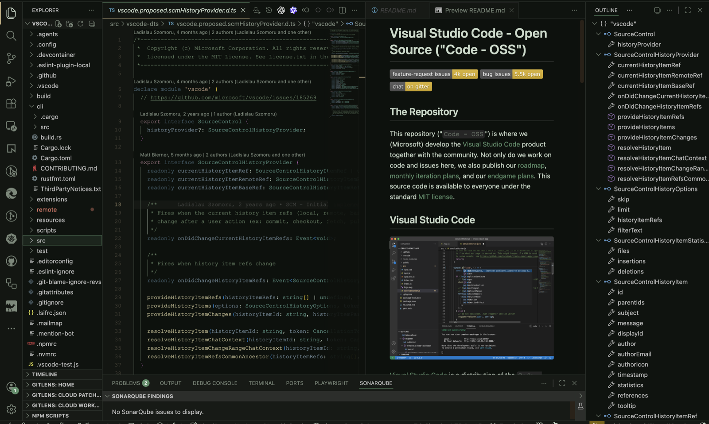
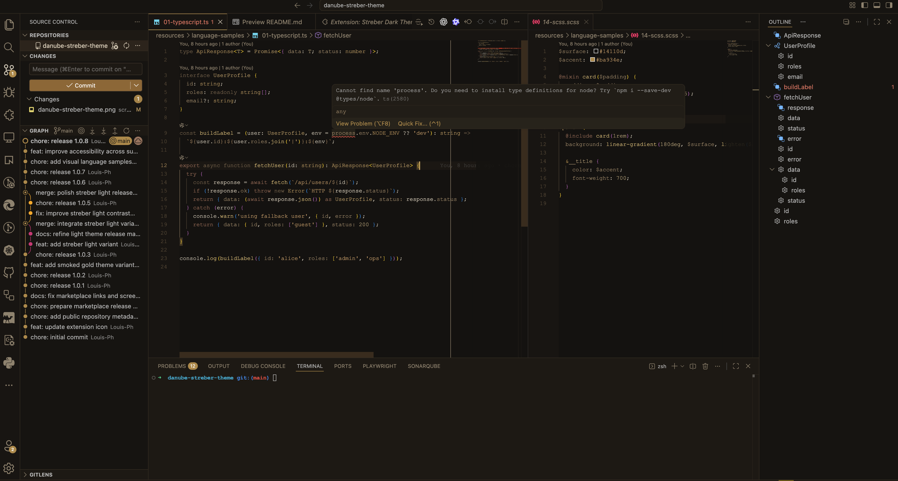
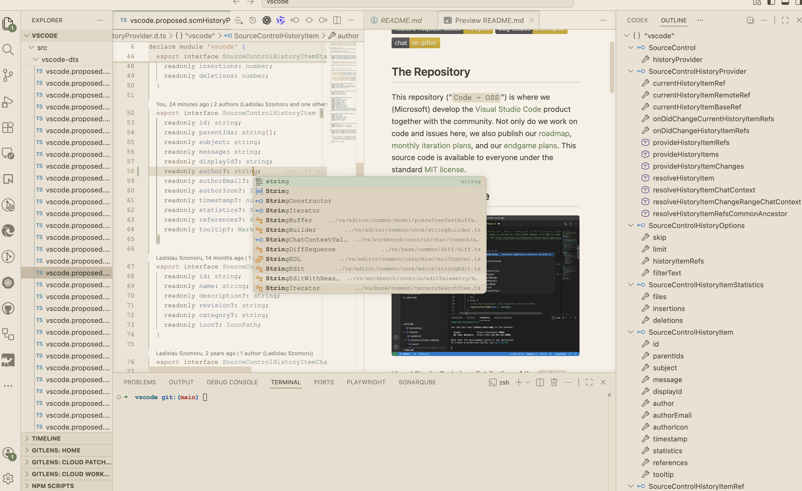

<h1 align="center">Danube Streber Theme Ecosystem</h1>

<p align="center">
  <em>An adaptive visual environment engineered for cognitive endurance and zero-distraction deep work.</em>
</p>

<p align="center">
  <a href="https://marketplace.visualstudio.com/items?itemName=streber-theme.streber-dark-theme"></a>
  <a href="https://marketplace.visualstudio.com/items?itemName=streber-theme.streber-dark-theme"></a>
  <a href="https://marketplace.visualstudio.com/items?itemName=streber-theme.streber-dark-theme"></a>
</p>

---

## 🐟 The Streber Philosophy

Most modern IDE themes fail by attempting to maximize contrast, bombarding the retina with neon colors that inevitably lead to visual and cognitive fatigue during complex, multi-hour debugging sessions.

We invert the problem: **How do we build a resilient visual ecosystem that actively reduces parsing effort?**

Taking inspiration from the _Zingel streber_—a highly resilient benthic fish native to the Danube River that thrives in deep, fast-flowing currents by maintaining a low profile—this collection is built for extreme visual endurance. By utilizing camouflage palettes, desaturated syntax, and precise highlights, the Streber ecosystem anchors your focus and keeps the editor strictly analytical.

## 🎛️ Three Adaptive Environments

Because external lighting conditions and retinal fatigue fluctuate, a single theme is a single point of failure. The Streber extension provides three coordinated environments to ensure continuous operability.

### 1. Streber Dark (The Deep Anchor)

Built for absolute focus. Deep camouflage greens, restrained blue-gray syntax, and sharp amber accents for structural clarity.
[](./screenshots/danube-streber-theme.png)

### 2. Streber Smoked Gold (The Late-Night Buffer)

Engineered for hours when blue light becomes toxic. Olive-brown surfaces, brass highlights, and honey-gold syntax warmth to mitigate eye strain.
[](./screenshots/streber-smoked-gold.png)

### 3. Streber Light (The Daylight Albedo)

Designed for high-glare daytime environments. Pale mineral backgrounds, sage accents, and strict contrast that prevents the text from washing out on bright screens.
[](./screenshots/streber-light.png)

---

## 📐 Structural Advantages

- **Semantic Rigor:** Strict, logical separation between keywords, types, functions, strings, and comments.
- **State Resilience:** Carefully tuned workbench colors ensure UI elements (explorer, tabs, terminal, diffs) remain legible without overpowering the code canvas.
- **Broad Spectrum Efficacy:** Calibrated primarily for `JavaScript/TypeScript`, `Python`, `Rust`, and essential configuration formats (`JSON`, `YAML`, `Shell`).

## 🚀 Installation

From VS Code Quick Open (`Ctrl+P` / `Cmd+P`):

```bash
ext install streber-theme.streber-dark-theme
```
